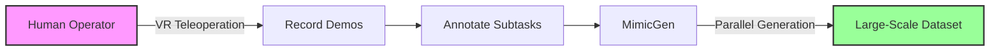

# Project Overview

WBCMimic is an enhanced robotics data collection framework built on NVIDIA Isaac Lab for generating demonstration datasets through VR teleoperation and MimicGen augmentation with whole-body control (WBC) capabilities.

## System Architecture

### Key Components

**isaaclab_mimic Extension**
- MimicGen integration
- Data generation pipelines
- Whole-body control (WBC)
- Dataset management (Zarr/HDF5)
- Task environment definitions
- Robot configurations and controllers
- VR teleoperation interfaces
- Physics simulation setup

## Data Collection Workflow

1. **Human Demonstration**: Collect initial demos via VR teleoperation
2. **Annotation**: Automatically annotate subtask completions
3. **Augmentation**: Generate variations using MimicGen
4. **Validation**: Verify generated data quality

## Supported Tasks

Current implementation includes tasks for multiple robots:

**UR5 Robot:**
- Put Bowl in Microwave & Close (3 subtasks)
- Clean Plate (6 subtasks with retry logic)

**ARX-X7 Robot:**
- Pick Toothpaste Into Cup & Push (3 subtasks for dual-arm mobile manipulation)

Tasks are designed with clear subtask boundaries for effective data augmentation using both unified and WBC control modes.
